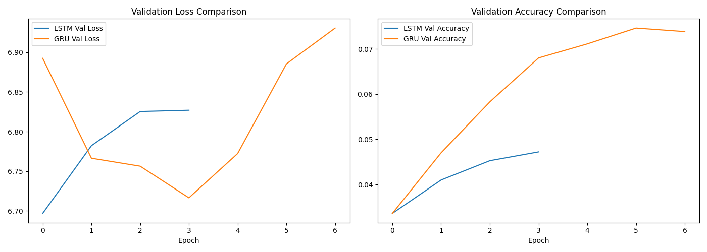

# Next Word Prediction using LSTM & GRU

A deep learning project that predicts the next word in a sequence of text, trained on Shakespeare's *Hamlet*. Built to compare LSTM and GRU recurrent architectures on the same task, dataset, and training regime.

**🚀 Live app:** [next-word-prediction-lstm-gru-ss.streamlit.app](https://next-word-prediction-lstm-gru-ss.streamlit.app/)

## Project Overview

This project implements a next-word prediction model using two RNN variants — **LSTM** and **GRU** — trained side-by-side under identical conditions, so their performance can be directly compared. The pipeline covers data collection, preprocessing, model training, evaluation, inference, and deployment (`app.py`, live on Streamlit Community Cloud).

## Dataset

- **Source:** `shakespeare-hamlet.txt` from the NLTK Gutenberg corpus
- **Size:** ~4,818 unique words (vocabulary), ~25,700 training sequences (n-grams)
- **Preprocessing:** lowercased, tokenized with Keras `Tokenizer`, converted into n-gram input sequences, padded to a uniform length (`max_sequence_len = 14`)

## Model Architectures

Both models share the same shape and training setup for a fair comparison:

| Layer | LSTM Model | GRU Model |
|---|---|---|
| Embedding | 100-dim | 100-dim |
| Recurrent 1 | LSTM(150, return_sequences=True) | GRU(150, return_sequences=True) |
| Dropout | 0.2 | 0.2 |
| Recurrent 2 | LSTM(100) | GRU(100) |
| Dense (output) | softmax, 4818 classes | softmax, 4818 classes |
| **Total params** | 1,219,418 | 1,157,418 |

**Training config:** Adam optimizer, categorical crossentropy loss, 50 epochs (capped by early stopping on `val_loss`, patience=3), 80/20 train-test split.

## Results

| Model | Val Loss | Val Accuracy |
|---|---|---|
| LSTM | 6.6968 | 3.36% |
| GRU | **6.7164** | **6.80%** |

Both models stopped early around epoch 7. **GRU outperformed LSTM on validation accuracy while using ~5% fewer parameters** — a reasonable result given GRU's simpler gating mechanism tends to converge faster on smaller datasets.



### Why accuracy is low — and what that means

Both models land in the single-digit accuracy range, and both test predictions below happened to return the same (most frequent) word, `"the"`:

```
Input: "To be or not to be"                    → Predicted: "the"
Input: "Barn. Last night of all, When yond same" → Predicted: "the"
```

This is a known and explainable limitation, not a bug in the pipeline:

- **Small corpus:** a single play (~25,700 training sequences) is a small dataset for a softmax classification task over ~4,818 output classes.
- **Early stopping triggers quickly** on a dataset this size, since validation loss stops improving well before the model has learned enough structure to move meaningfully beyond the most-frequent-word baseline.
- The **relative comparison between LSTM and GRU is still valid and meaningful** even though absolute accuracy is low — GRU's edge here is a legitimate, reproducible finding.

### What I'd do differently with more time/data

- Train on a larger, multi-work corpus (e.g., several Shakespeare plays from the Gutenberg corpus) to grow both vocabulary coverage and training volume
- Increase early stopping patience to allow more epochs before halting
- Experiment with smaller hidden-layer sizes to reduce the params-to-data ratio
- Add perplexity as a secondary evaluation metric alongside accuracy

## Deployment Notes

Deploying this to Streamlit Community Cloud surfaced a real cross-platform bug worth documenting:

**Problem:** The model was originally saved with `model.save("next_word_lstm.keras")` on Windows. Loading it locally worked fine, but deploying to Streamlit Cloud (which runs Linux) failed with a `ValueError` deep inside Keras's `saving_lib.py`. Inspecting the saved file's internal structure showed HDF5 group keys like `layers\dense` and `layers\lstm\cell` — using **Windows backslashes** instead of the forward slashes Keras's saving format expects internally. This is a known Keras/h5py issue where `.keras` and `.weights.h5` files saved on Windows can embed OS-specific path separators that break when the file is loaded on Linux.

**Fix:** Rather than relying on Keras's full model/weights serialization (which round-trips through this path-separator-sensitive HDF5 format), the model architecture is rebuilt directly in `app.py` from code, and only the raw weight arrays are loaded — saved and restored as a plain NumPy `.npy` file (`lstm_weights.npy`) via `model.get_weights()` / `model.set_weights()`. This bypasses HDF5 group naming entirely, so there's no OS-specific path data involved, and the same file loads identically on Windows and Linux.

This mirrors a similar OS-level deployment blocker hit on an earlier project (AWS Elastic Beanstalk, Windows path separators in the deployment ZIP) — a recurring theme worth being ready to discuss: **cross-platform path handling is a common, easy-to-miss failure mode when developing on Windows and deploying to Linux-based cloud platforms.**

## Project Structure

```
LSTM+RNN/
├── app.py                        # Deployment/inference script (Streamlit)
├── experiemnts.ipynb             # Main notebook: data prep, training, evaluation
├── hamlet.txt                    # Raw training corpus
├── lstm_vs_gru_comparison.png    # Validation loss/accuracy comparison plot
├── lstm_weights.npy              # LSTM weights (NumPy format, used by app.py)
├── tokenizer.pickle              # Saved tokenizer
└── requirements.txt              # Dependencies
```

## Setup & Usage

```bash
# Create and activate a virtual environment
python -m venv venv
venv\Scripts\activate        # Windows

# Install dependencies
python -m pip install -r requirements.txt

# Run the notebook to reproduce training
jupyter notebook experiemnts.ipynb

# Or run the Streamlit app locally
streamlit run app.py
```

## Tech Stack

Python, TensorFlow/Keras, Streamlit, NLTK, NumPy, Pandas, scikit-learn, Matplotlib

## Author

**Shubaash S S**
[GitHub](https://github.com/Shubaash-ss) · [LinkedIn](https://linkedin.com/in/shubaash-s-s-00796127a)